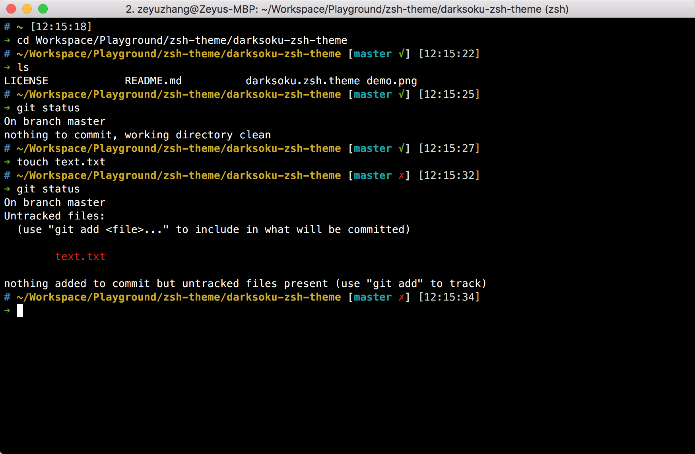

# Darksoku zsh theme

Darksoku theme is based on [ys](http://blog.ysmood.org/my-ys-terminal-theme/) theme and  [astro](https://github.com/iplaces/astro-zsh-theme)  theme. 

## Sample Demo



## Installation

#### Clone the repository:

```
$ git clone https://github.com/TooSchoolForCool/darksoku-zsh-theme.git
```

#### Theme

1. Run the installation script `./install.sh` or `sh install.sh`
2. Change the theme variable name to `ZSH_THEME="darksoku"` in `~/.zshrc`
3. Reload ZSH with `source ~/.zshrc`